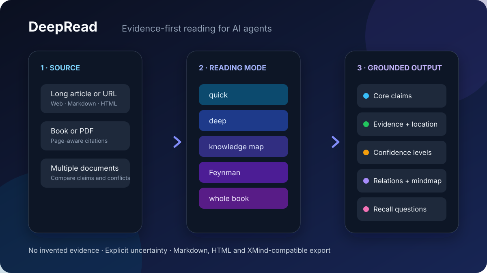

# 📖 DeepRead 精读助手（dsh-deepread）

[English](README.md) | 中文

> 精读一本书或一篇文章：提取核心观点、论证结构与关键论据，输出「观点—证据—数据—关系」结构化报告。
> 官方 bundle 插件：Node half 注册 `deepread` 工具，client half 提供结果卡片与输入区精读条。

[](https://www.npmjs.com/package/dsh-deepread)
[](https://beancookie.github.io/awesome-dsh-plugin)
[](LICENSE)



DeepRead 同时提供两种兼容形态：

- **便携 Agent Skill**：适用于 Codex、Claude Code 及其他兼容 Agent Skills 的工具，零运行时依赖。
- **完整 DeepSeek Harness 插件**：包含 `deepread` 工具、浏览器界面、PDF 抽取、后台任务、进度显示、批量对比、成本预估和 HTML/XMind 导出。

## 快速开始

```sh
# Codex / Claude Code / Agent Skills
npx skills@latest add xiehuan123/dsh-deepread

# 完整 DSH 插件
dsh plugin --profile web add dsh-deepread
```

真实输出样例：[`deep` 深度精读](examples/claude-code-token-optimization.md) · [`map` 知识地图](examples/ad-fact-check-knowledge-map.md) · [架构文章精读](examples/vivo-tauri-architecture.md)

## 功能

| 能力 | 说明 |
| --- | --- |
| 🎛️ 五种模式 | `quick` 快速抓要点 · `deep` 深度精读 · `map` 知识地图 · `feynman` 费曼读书法（11 步闭环 + 间隔复习）· `book` 整本书分部分精读（对比见下方「五种模式对比」） |
| 🗺️ 知识地图模式 | 核心问题 / 核心结论 / 十类内容分类（核心结论、分论点、原因或作用机制、事实、数据、案例、隐含前提、反对意见、限制条件、可执行建议）/ 观点必配证据（无证据标注「原文未提供证据」）/ 关键数据表（数值与单位、时间范围、样本、比较基准、来源、位置）/ 八种关系标注（支持、反驳、导致、解释、取决于、举例、对比、限制）/ **四档置信度**（作者原意、原文事实与数据、合理推断、无法确认）/ Mermaid 思维导图 / XMind 大纲 / 5 个主动回忆问题 |
| 📥 三种输入 | 微信公众号链接（`mp.weixin.qq.com` 稳定链接）· 文件（`.txt/.md/.html/.pdf`，PDF 内置纯 JS 提取器，含中文 ToUnicode 映射、页码标记与对象流/交叉引用流支持）· 粘贴文本 |
| 📤 可选导出 | 默认只在会话中展示；`export` 参数可选 `md` / `mm`（FreeMind，XMind 可导入）/ `html`（编辑风网页报告，深浅色自适应）/ `all`，写入工作区 `deepread-output/` |
| 🎨 浏览器 UI | `deepread` 工具结果卡片（置信度四色图例、折叠分区）+ 输入区左侧 📖 快捷按钮，点击弹出卡片式精读面板（链接/路径/正文 + 模式/导出选择 + 关注重点 + 一键开始） |
| 🔀 批量对比 | `batch` 一次给 2-10 篇（各带 url/path/text），逐篇速览 + 跨篇对比报告：对比矩阵、冲突点、互补关系与综合结论 |
| 📍 引用溯源 | 报告带页码/段落定位：分论点、金句与专门的引用溯源表把论断定位回原文【第N页】标记 |
| 🧮 预算预检 | `estimate: true` 不调用模型，先给出各模式的预计 token、调用次数与耗时（中文≈0.6 token/字；速率与延迟默认按当前模型族自动取值，也可显式配置覆盖） |
| 📚 最近读过 | Web 面板内置本地历史记录（localStorage），一键重新精读 |
| ⏳ 进度透明 | 长文/大 PDF/批量精读自动转为官方后台任务：任务名标注分段数与预算；进度流逐段推送「精读第 3/20 段…」，job_output 轮询进度与最终报告，job_kill 可取消 |
| 🔍 解析进度 | 大 PDF 的全量解析挪进后台任务内**逐页推送**「解析 PDF 中… 42%（10/24 页）」（采样预检判长，返回后台任务前不再静默等待）；批量精读逐篇推送「解析第 2/5 篇… / 精读第 2/5 篇… / 完成第 2/5 篇」与「跨篇对比汇总中…」 |
| 🧮 面板预算 | Web 面板模式按钮上方实时显示各模式 token 与耗时（如 深度精读 (≈38k token · ≈8分钟)），粘贴文本即时计算，并随真实模型速度自校准；链接/文件路径点面板「🔍 预算预检」按钮，经同源 API（`POST /api/deepread/budget`）由 Host 直接抓取/读取并估算，**面板内即时显示一行结论**（约 N 字 · ≈X token · ≈Y 分钟），不跳对话、不渲染表格 |
| ⚡ 采样预检 | estimate 模式对 PDF 只采前 2 页并按页数外推，大 PDF 预算毫秒级返回 |
| 🎯 自校准 | 每次模型调用实测 token/秒，滚动平均持久化——估算随你的真实模型速度收敛；冷启动默认值按模型族给出（DeepSeek/Kimi/Qwen 等 ≈100-110 tok/s，Claude ≈70，GPT ≈90） |

## 五种模式对比

| 模式 | 适合场景 | 输出要点 | 代价 |
| --- | --- | --- | --- |
| `quick` 快速要点 | 「这篇文章讲啥？」速览 | 一句话总结、核心论点、论证结构、金句、核心概念、批判性问题 | 单次调用，最快 |
| `deep` 深度精读（默认） | 认真读懂一篇文章 | 概述、核心论点、论证结构（论点+论据+原文引文）、论证脉络、各部分要点、金句、核心概念、批判性思考 | 长文自动分段，逐段+汇总 |
| `map` 知识地图 | 研究、查证、写引用前的事实核查 | 核心问题与结论、十类内容分类、观点必配证据、关键数据表（五要素）、八种关系、四档置信度、Mermaid 导图、XMind 大纲、主动回忆问题 | 结构化管线，多次调用 |
| `feynman` 费曼读书法 | 真正学会、能给别人讲 | 11 步闭环：目录→提问→分章→观点/数据/证据→章节导图→合上书讲解→自检缺口→回原文修正→合并导图→再讲一次→第 1/3/7/14/30 天间隔复习 | 输出最长、调用最多 |
| `book` 全书精读 | 整本书 / 超长文本 | 目录、章节脉络、分部分精读后汇总的全书总结 | 按部分分批处理 |

一句话选型：赶时间用 `quick`；读透一篇用 `deep`；要引证查事实用 `map`；要真学会并记住用 `feynman`；整本书用 `book`。

## 安装

### DeepSeek Harness（工具 + Web UI，完整功能）

需要本机已安装 **pnpm**（`dsh plugin` 命令底层调用 pnpm 安装插件）与 Node.js ≥ 22。

```sh
# 从 npm 安装（预构建产物，无需构建授权）
dsh plugin --profile web add dsh-deepread

# 指定版本
dsh plugin --profile web add dsh-deepread@^0.5.4

# 从 GitHub 安装（源码；构建产物已提交）
dsh plugin --profile web add "github:xiehuan123/dsh-deepread#v0.5.4"
```

重启 dsh web 后生效。输入区左侧出现 📖 快捷按钮，点击弹出卡片式精读面板。对话中也可直接说「用知识地图模式精读这篇文章：<内容>」。

> 提示：抓取微信公众号链接需要 HTTP provider。安装后若报「网页抓取服务不可用」，请在 profile 的 `cordis.patch.yml` 中挂载 `@deepseek-ai/dsh-web-fetch-http` 并为它配置浏览器 User-Agent（微信有反爬验证页）。

### Codex / Claude Code（skill 形态，零依赖）

安装（三选一）：

```bash
claude plugin install xiehuan123/dsh-deepread      # 终端命令（Codex 兼容）
/plugin install xiehuan123/dsh-deepread            # 或会话内斜杠命令
npx skills@latest add xiehuan123/dsh-deepread      # 或 skills.sh
```

**使用说明**（Codex / Claude Code 通用）：

1. **触发**：直接说一句包含「精读 / 分析 / 知识地图 / 费曼」的话，例如
   - `精读一下 docs/architecture.md`
   - `用知识地图模式分析这篇文章：<粘贴正文>`
   - `用费曼读书法读这本书，给我复习计划`
   - `快速抓一下这篇公众号文章的要点：https://mp.weixin.qq.com/s/xxxx`
2. **模式**：agent 会按诉求自动选择（默认 `deep`），五种模式见上表；不确定时它会问你要哪种。
3. **输入**：文件路径 / 网页链接（微信公众号可直接抓；知乎/掘金等反爬站点请粘贴正文）/ 直接粘贴文本，PDF 也能处理（agent 会按 `SKILL.md` 的指引抽取文本，扫描版建议先 OCR）。
4. **输出**：默认只在对话里给 Markdown 报告；你说「导出 html / 导图 / md」时，它会把报告写入工作区 `deepread-output/`（`.md` 报告、`.mm` FreeMind 思维导图【XMind 可导入】、`.html` 网页报告）。
5. **知识地图模式**：输出含四档置信度（作者原意/原文事实与数据/合理推断/无法确认），每条观点配证据——原文没有证据会明确标「原文未提供证据」。
6. **费曼模式**：完整 11 步（目录→提问→分章→观点数据证据→章节导图→合上书讲解→自检缺口→回原文修正→合并导图→再讲一次→第 1/3/7/14/30 天间隔复习计划）。

> 提示：Codex 版的 skill 是「方法论」形态——由 agent 用自己的工具执行分析；DSH 版的 `deepread` 是「工具」形态——由插件直接调用模型跑流水线。两者输出格式一致，可互相迁移（把导出的 `.md`/`.html` 交给任一端的 agent 都能继续工作）。

## 使用示例

```
请用 deepread 精读这个链接：https://mp.weixin.qq.com/s/xxxx
用知识地图模式精读 book.pdf，导出 html
快速抓一下这篇文章的要点：<粘贴文本>
```

## 参数

| 参数 | 类型 | 说明 |
| --- | --- | --- |
| `url` | string | 微信公众号稳定链接（仅 mp.weixin.qq.com；知乎/掘金等反爬站点请粘贴正文） |
| `path` | string | 工作区文件路径（.txt/.md/.markdown/.html/.pdf） |
| `text` | string | 粘贴文本 |
| `depth` | enum | `quick` / `deep`（默认）/ `map` / `feynman` / `book` |
| `export` | enum | `none`（默认，仅会话展示）/ `md` / `mm` / `html` / `all` |
| `refresh` | boolean | `true` 强制重新抓取并刷新缓存（默认 `false`：同一链接命中缓存直接复用全文，不联网） |
| `focus` | string | 读者关注角度，如「论证逻辑」「研究方法」 |
| `language` | enum | `zh` / `en` / `auto`（默认） |

## 仓库结构

```
├── package.json            # dsh.bundle + dsh.client + dsh.skills
├── cordis.patch.yml        # insert 挂载自身
├── index.mjs               # Node half：Cordis entry（deepread 工具 + PDF/HTML 解析 + 三格式导出）
├── src/client/index.js     # Client source：结果卡片 + 输入区精读条 + 精读面板（工厂包体）
├── scripts/build-client.mjs# 将 client source 打包为 C6 工厂包产物 lib/client.js（勿手改）
├── lib/client.js           # Client half（生成产物）：__ModuleLoader__.load({ id, factory })
├── test/                   # 冒烟测试：Node 工具链路 + client 工厂包契约
├── skills/dsh-deepread/    # Codex / Claude Code 兼容 skill（SKILL.md + references + agents/openai.yaml）
├── .claude-plugin/         # Claude Code 插件清单（plugin.json + marketplace.json）
└── .codex-plugin/          # Codex 插件清单（plugin.json）
```

`@deepseek-ai/*` 官方包（cordis / dsh-tools / schemastery / dsh-storage-domain）与 `zod`、`react`
由宿主 profile 提供，在 `peerDependencies` 中声明（`*` 表示跟随宿主版本）；`dsh.client.inject`
声明客户端依赖边（dsh-client-runtime 提供 slots/sessions，dsh-client-ui-conversation 提供 conversation）。

## 全文缓存

URL 抓取的全文按官方 storageDomain 约定落盘：`deepread_url_cache` 领域（版本 1，zod schema
校验，记录含 `url`/`text`/`fetchedAt`），存于 `$DSH_HOME/storages/`，跨进程重启仍然有效。
同一篇文章换模式（deep→map/feynman/book）直接复用缓存、不再联网；抓取失败时自动回退缓存并
在报告中注明。TTL 默认 7 天，条目上限 200（写入时惰性清理过期项）。未挂载 storage 的
profile（如无 web 组合包的 headless）自动降级为进程内缓存。

## 插件配置（Config）

`timeoutMs`（默认 900000）、`chunkChars`（默认 6000）、`maxParts`（默认 20）、
`maxInputChars`（默认 400000）、`cacheEnabled`（默认 true）、`cacheTtlHours`（默认 168，
0 表示不缓存）均可在 cordis 行配置中覆盖，例如：

```yaml
- insert:
    - id: deepread
      name: dsh-deepread
      config:
        timeoutMs: 600000
        cacheTtlHours: 24
```

## 开发

```sh
npm run build:client   # 从 src/client/index.js 重新生成 lib/client.js
npm test               # Node 工具链路冒烟 + client 工厂包契约测试
```

## License

MIT
