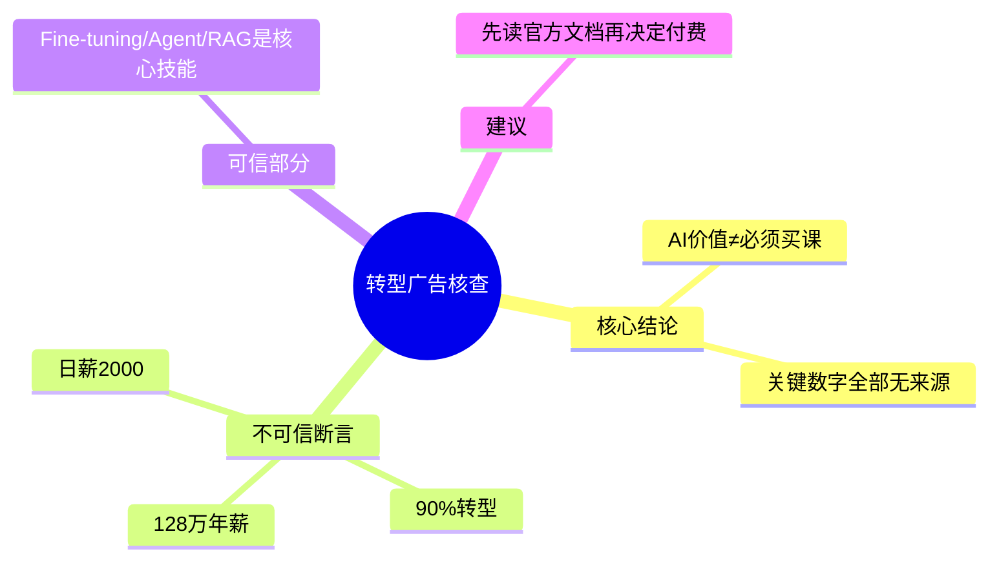

# 🗺️ 知识地图：「90% 传统开发人阵痛转型」一文的事实核查

**摘要**：这是一篇课程营销软文：趋势判断「AI 能力有价值」被偷换成商业结论「必须购买本课程」，关键数字全部无来源。

**核心问题**：传统开发人是否真的正在被快速淘汰，以至于必须立刻报名该课程？

**核心结论**：

1. 该文是课程营销软文，核心主张缺乏数据支撑
2. Fine-tuning / Agent / RAG 确是大模型应用开发的核心技能，但这不构成购买理由

**观点与证据表**：

1. [分论点] Fine-tuning、Agent、RAG 是大模型应用开发的三块核心技能
   证据：原文列举三项技能并给出定义（针对行业数据优化模型 / 自主调用工具执行流程 / 构建专属知识库）（文中技能清单） [作者原意]
   ↳ 支持 → 课程涵盖这三大核心
2. [事实] 90% 的传统开发人今年将面临阵痛性转型
   证据：原文未提供证据（无调查、无样本、无来源）（开篇断言） [无法确认]
3. [事实] 字节为「大模型应用架构专家」开出最高 128 万元年薪
   证据：原文未提供证据（无招聘链接或统计口径）（薪资段落） [无法确认]
   ↳ 支持 → 你的成长速度会直接体现在工资条上
4. [事实] 部分大厂 AI 实习生日薪高达 2000 元
   证据：原文未提供证据（薪资段落） [无法确认]
5. [事实] 课程开班 58 期、已服务 20000+ 学员
   证据：原文未提供证据（商家自述，无第三方验证）（课程介绍） [无法确认]
6. [数据] OpenClaw 爆火后传统代码技能正在贬值
   证据：原文未提供证据（趋势断言，无数据支撑）（正文第4段） [无法确认]
   ↳ 导致 → 企业不会再为写代码支付高薪
7. [反对意见] 「AI 能力有价值」与「必须购买本课程」之间没有逻辑必然
   证据：原文未提供证据：全文从技术趋势直接跳转到课程销售，属于把相关关系写成因果关系（全文结构） [合理推断]
   ↳ 支持 → 核心结论一
8. [限制条件] 「24 小时后关闭通道」「仅限 100 人」是稀缺性促销设计
   证据：原文未提供证据：这类时限话术是标准营销压力设计，不构成真实供给约束（报名段落，出现 3 次） [合理推断]
9. [可执行建议] 想学大模型应用开发，先读官方文档与开源项目，再决定是否付费
   证据：原文未提供证据（建议项，非原文内容） [无法确认]

**关键数据表**：

- 128 万元/年（最高） · 时间：未注明 · 对象：大模型应用架构专家（字节） · 基准：无 · 来源：原文未提供数据来源 · 位置：薪资段落
- 2000 元/日 · 时间：未注明 · 对象：大厂 AI 实习生 · 基准：无 · 来源：原文未提供数据来源 · 位置：薪资段落
- 58 期 / 20000+ 学员 · 时间：未注明 · 对象：该训练营 · 基准：无 · 来源：商家自述 · 位置：课程介绍
- 90%（转型比例） · 时间：今年 · 对象：传统开发人 · 基准：无 · 来源：原文未提供证据 · 位置：开篇断言

**反对意见与局限**：

- 全文所有关键数字均无调查、样本、来源，置信度均为「无法确认」
- 「技术趋势」与「购买行为」之间的因果被强行焊接，属于把相关关系写成因果关系
- 反复出现的时限与名额话术（出现 3 次）是典型的稀缺性促销压力设计

**Mermaid 思维导图**：



**XMind 大纲**：

```markdown
转型广告核查
	核心结论
		AI价值≠必须买课
		关键数字全部无来源
	不可信断言
		90%转型
		128万年薪
	可信部分
		Fine-tuning/Agent/RAG
```

**主动回忆问题**：

1. 这篇广告的哪句话是趋势判断，哪句话是商业结论？
2. 「90%」「128万年薪」这些数字的样本与来源是什么？（答案是：没有）
3. 大模型应用开发的三块核心技能分别是什么？
4. 「24小时后关闭」出现了几次？这种话术的目的是什么？
5. 如果我想学 RAG，第一步应该做什么？
